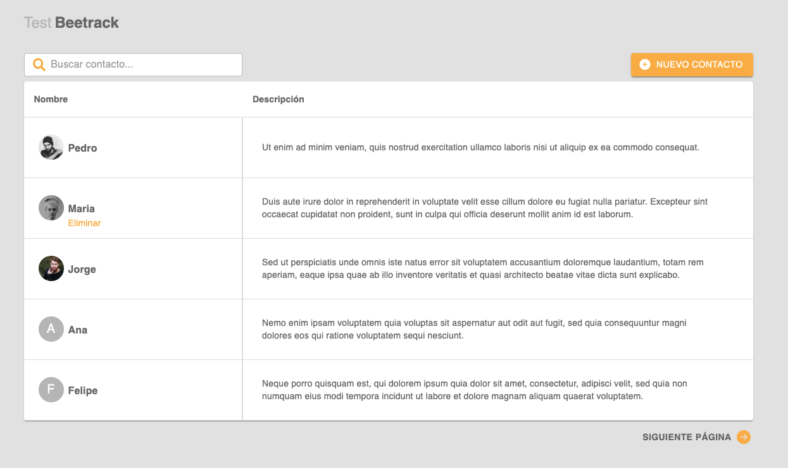

<div align="center">
    <a href="https://es.reactjs.org/" target="blank"></a>

</div>
<div>

<h1 align="center"> Beetrack Test</h1>

> React Native

> Javascript

Descripción del proyecto : Proyecto app web para la gestión de usuarios. Se puede listar, añadir y eliminar usuarios. Para el back se usa el proyecto [frontend-test](https://github.com/Beetrack/frontend-test) el cual debe estar corriendo con las instrucciones propias del proyecto para el correcto funcionamiento de este proyecto.



## Tabla de contenido

- [Comenzando](#comenzando)
  - [Instalación](#instalación)
  - [Desarrollo](#desarrollo)
- [Documentación](#documentación)
  - [Estructura](#estructura)
- [Herramientas](#herramientas)
- [Equipo](#equipo)

## Comenzando

A continuación se listarán todos los puntos necesarios para comenzar a desarrollar con el proyecto actual desde su fase de instalación hasta levantar un ambiente local de desarrollo sin problemas.

## Instalación

```bash
$ yarn install
```

## Desarrollo

Ejecutar `yarn start` para un servidor de desarrollo. Navega a `http://localhost:3000/`

```bash
$ yarn start
```

## Documentación

A continuación se realizará una referencia a la arquitectura establecida en el proyecto.

## Estructura

```
|-- src
    |-- [+] services
        |-- api.js
        |-- userServices.js

    |-- [+] redux
        |-- store.js
        |-- user.js

    |-- [+] components
        |-- [+]addUserModal
            |-- addUserModal.component.js
            |-- addUserModal.scss
            |-- labels.js
        |-- errorModal

    |-- [+] screens
        |-- [+]home
            |-- [+]components
                |--[-]header
                |--[-]options
                |--[-]userList
            |-- home.layout.js
            |-- home.screen.js
    |-- [+] scss
        |-- global.scss
        |-- colors.scss

    |-- [+] utils
        |-- apiUrlConfig.js
        |-- config.js

|-- package.json
|-- index.js
|-- App.js

```

## Herramientas

- [React](https://es.reactjs.org/)
- [Material-UI](https://mui.com/)
- [Redux](https://react-redux.js.org/)
- [Redux-Thunk](https://github.com/reduxjs/redux-thunk)
- [Axios](https://es.reactjs.org/)
- [Sass](https://sass-lang.com/)
- [React-icons](https://react-icons.github.io/react-icons/)

## Equipo

Desarrollado por Diego Plaza Garrido
